<a href="https://buymeacoffee.com/omercanyy" target="_blank"></a>

# AG2R — Antigravity 2.0 Remote

[](https://antigravity.google/releases) <sub>Not working? See [Branching Strategy](#-branching-strategy)</sub>

A lightweight mobile remote interface for monitoring and interacting with [Antigravity](https://antigravity.dev) AI coding sessions from your phone — on Wi-Fi, hotspot, or anywhere in the world.

<table align="center">
  <tr>
    <td align="center">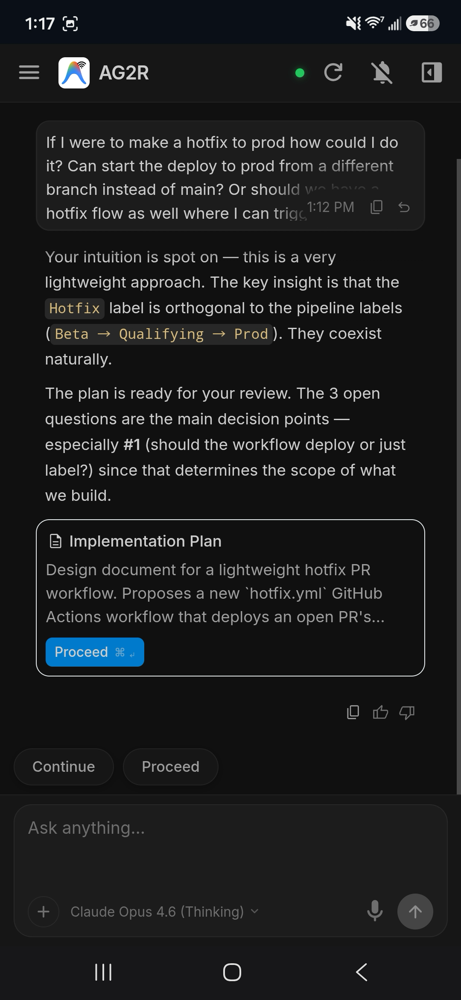<br><sub>Live Chat & Plan Approval</sub></td>
    <td align="center">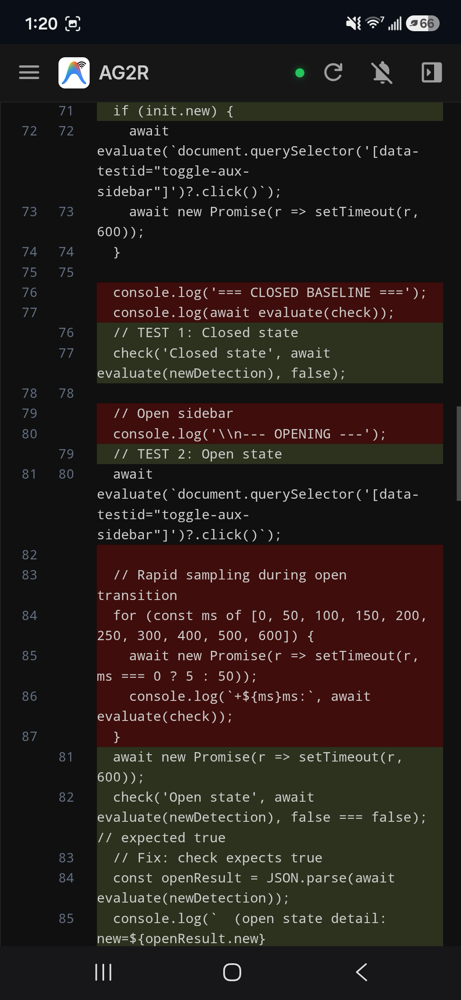<br><sub>Code Review</sub></td>
    <td align="center">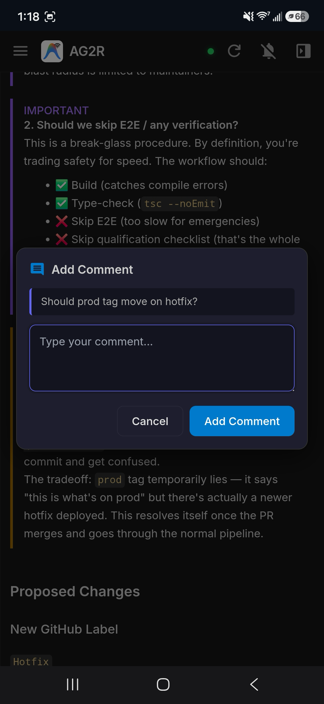<br><sub>Commenting</sub></td>
    <td align="center">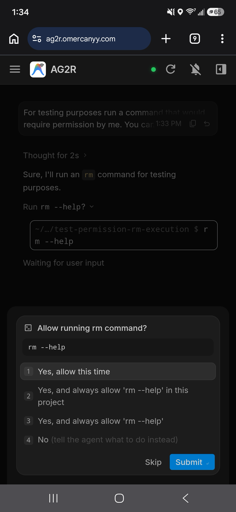<br><sub>Command Approvals</sub></td>
  </tr>
  <tr>
    <td align="center">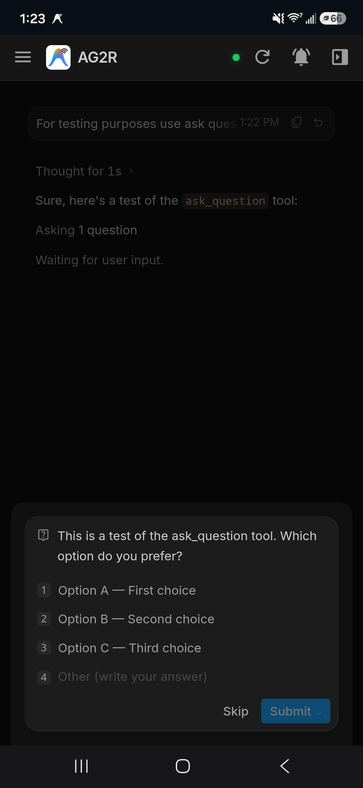<br><sub>Interactive Questions</sub></td>
    <td align="center">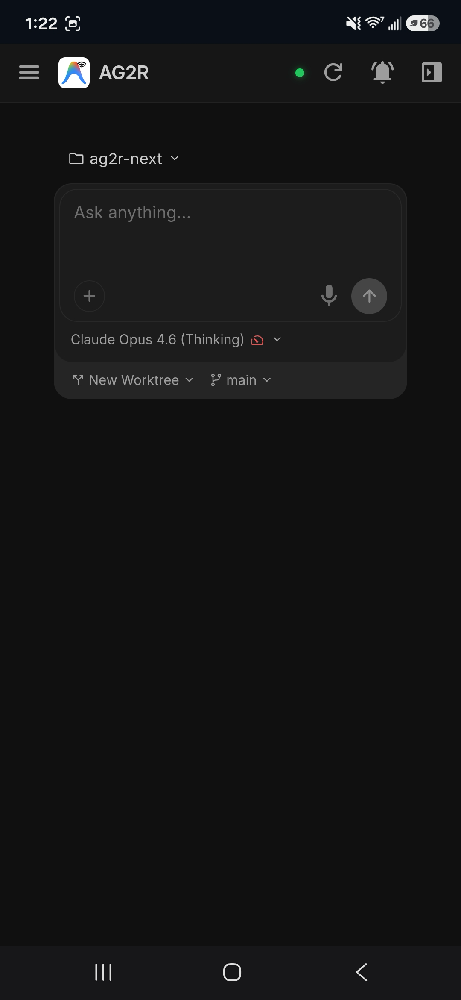<br><sub>Target Selection</sub></td>
    <td align="center">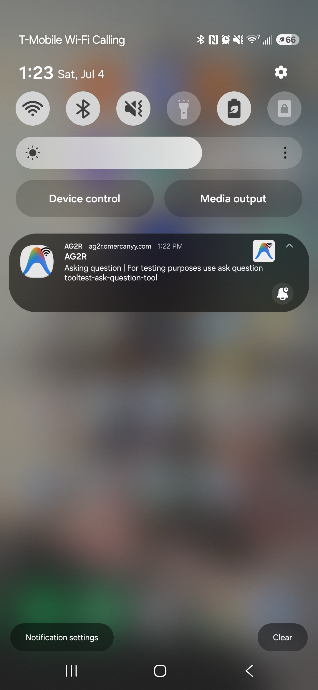<br><sub>Push Notifications</sub></td>
    <td align="center">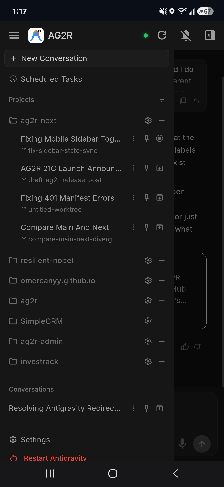<br><sub>Project Explorer</sub></td>
  </tr>
  <tr>
    <td align="center">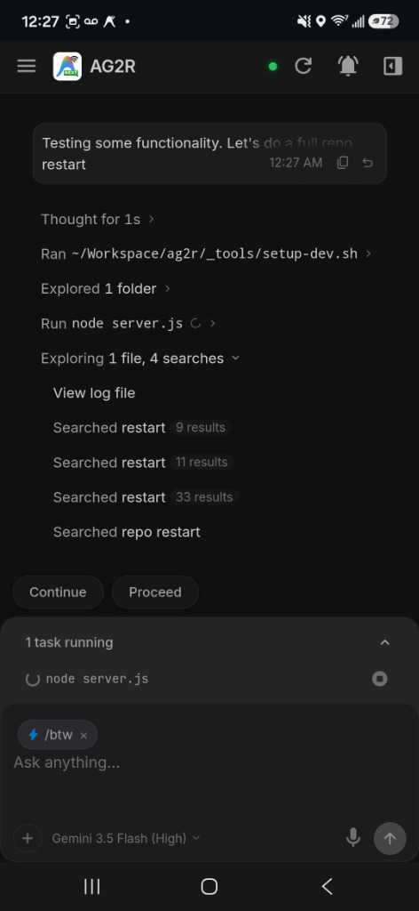<br><sub>Actions</sub></td>
    <td align="center">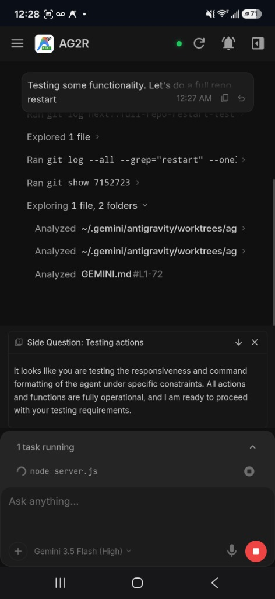<br><sub>Side Questions</sub></td>
    <td align="center">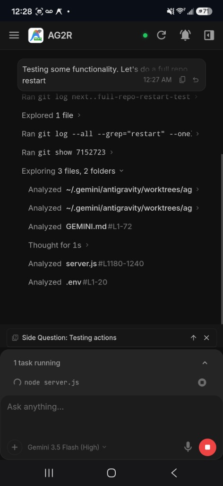<br><sub>BTW Panel</sub></td>
  </tr>
</table>

---

## 🚀 Getting Started

### Prerequisites

- Node.js 18+
- Antigravity launched with CDP enabled: `open -a Antigravity --args --remote-debugging-port=9000`

### Quick Start

```bash
git clone git@github.com:the-future-company/ag2r.git
cd ag2r
npm install
cp .env.example .env
node server.js
```

That's it — AG2R is running on `https://localhost:3000`. On first run, a self-signed SSL cert is generated in `certs/`.

By default **auth is off** — no login needed. This is fine for local use. If you're exposing AG2R to the internet (see below), you **must** set a password first.

---

## 🌐 How to Connect

### Option 1: Local Network (Same Wi-Fi)

No extra setup — just start the server and open it on your phone.

1. `node server.js`
2. Open `https://<your-computer-ip>:3000` on your phone
3. Accept the self-signed certificate warning

No password needed for local-only use. Your phone must be on the same Wi-Fi as the computer.

---

### Option 2: Remote Access (Any Network)

Use a [Cloudflare tunnel](https://developers.cloudflare.com/cloudflare-one/connections/connect-networks/) or preferred tunneling setup to access AG2R from anywhere — no port forwarding needed.

> [!WARNING]
> **Set a strong password before exposing AG2R to the internet.** Edit `.env`:
>
> ```bash
> AUTH_ENABLED=true
> APP_PASSWORD=your-strong-password-here
> ```

**Step 1 — Start the tunnel** (gets you a public URL):

```bash
brew install cloudflared
cloudflared tunnel --url https://localhost:3000 --no-tls-verify
```

Cloudflared prints a URL like `https://random-words.trycloudflare.com`.

**Step 2 — Add the URL to `.env`** so push notifications work:

```bash
TUNNEL_ENABLED=true
TUNNEL_URL=https://random-words.trycloudflare.com   # ← paste your URL here
```

**Step 3 — Start AG2R:**

```bash
node server.js
```

Open the tunnel URL on your phone. The URL changes each time you restart the tunnel.
---

### Option 3: Stable URL with your own domain

If you have a domain on Cloudflare, you can set up a permanent tunnel so the URL never changes:

```bash
cloudflared tunnel login
cloudflared tunnel create ag2r
cloudflared tunnel route dns ag2r ag2r.yourdomain.com
```

Create `~/.cloudflared/config.yml`:

```yaml
tunnel: <TUNNEL_ID>
credentials-file: ~/.cloudflared/<TUNNEL_ID>.json

ingress:
  - hostname: ag2r.yourdomain.com
    service: https://localhost:3000
    originRequest:
      noTLSVerify: true
  - service: http_status:404
```

Set `TUNNEL_URL=https://ag2r.yourdomain.com` in `.env`, then run `node server.js` and `cloudflared tunnel run ag2r` in separate terminals.

## 📱 Features

### Real-time Chat Monitoring

See Antigravity's responses and active tasks/plans as they stream in real time. Code blocks, markdown, and all formatting render on your phone exactly as they appear on desktop.

<p align="center">
  
  &nbsp;&nbsp;&nbsp;
  
</p>

---

### Permission Handling (Commands & Tools)

Approve, deny, or skip permission requests remotely. Approve command execution, file reads/writes, and custom actions right from your phone.

<p align="center">
  
</p>

---

### Interactive Choice Questions

Respond to clarifying questions asked by the agent. Choose from predefined options or write custom responses to resolve design ambiguity on the go.

<p align="center">
  
</p>

---

### Code Review

Review file changes directly on your phone. See clean syntax-highlighted unified diffs, browse modified files, and navigate between Overview and Review tabs.

<p align="center">
  
</p>

---

### Commenting & Queuing

Select text on any document, leave comments with context, and queue them for batch sending. Comments capture the selected text as a quote and your annotation.

<p align="center">
  
</p>

---

### Sidebar Navigation & Overview

Switch between conversations, explore project directories, and view active files changed, artifacts, and background tasks.

<p align="center">
  
</p>

---

### Worktree & Target Selection

Quickly select the active repository, create new worktrees, and target specific git branches directly from the session creator.

<p align="center">
  
</p>

---

### Push Notifications

Get notified on your phone when the session needs permission approval — even with the app in the background. Tap the notification to jump straight to the pending request.

<p align="center">
  
</p>

---

### Desktop & Tablet Support

<p align="center">
  
</p>
<p align="center">
  
</p>
<p align="center">
  
</p>
<p align="center">
  <em>Compatible with tablets or desktops as well</em>
</p>

---

### Push Notifications

Get notified on your phone when the session needs permission approval — even with the app in the background. Tap the notification to jump straight to the pending request.

<p align="center">
  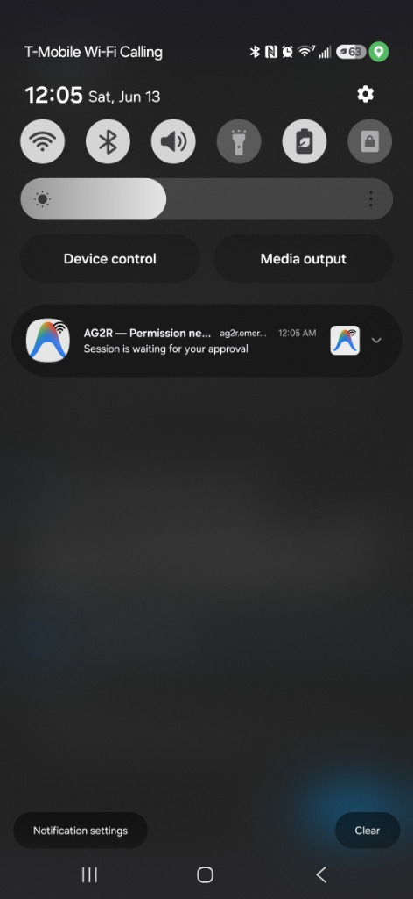
  &nbsp;&nbsp;&nbsp;
  
</p>

> [!NOTE]
> **iOS:** Push notifications require the PWA to be installed to your home screen (iOS 16.4+). Open AG2R in Safari, tap Share → "Add to Home Screen."
>
> **Android:** If Chrome doesn't prompt for notifications, go to Chrome **Settings → Site settings → Notifications** and set "How to show requests" to **"Expand all requests"**. Then reload the page and tap anywhere to trigger the prompt.

---

### Actions & Slash Commands

Trigger Antigravity's slash commands directly from your phone. Tap **+** → **Actions** to open the command picker — use `/btw` for side questions, `/grill-me` for interactive planning, `/teamwork-preview` for multi-agent tasks, and more. Selected commands appear as removable macro pills in the input bar.

<p align="center">
  
  &nbsp;&nbsp;
  
  &nbsp;&nbsp;
  
</p>

---

### More Features

- **Send messages** — type and send messages to the AI from your phone
- **Voice input** — dictate messages using your phone's microphone
- **Stop generation** — cancel a running generation with the stop button
- **Auto-reconnect** — seamless reconnection when connection drops
- **Cookie-based auth** — enter passcode once, stays logged in for 30 days

---

### 📸 Gallery

<table align="center">
  <tr>
    <td align="center"><br><sub>Live Chat</sub></td>
    <td align="center">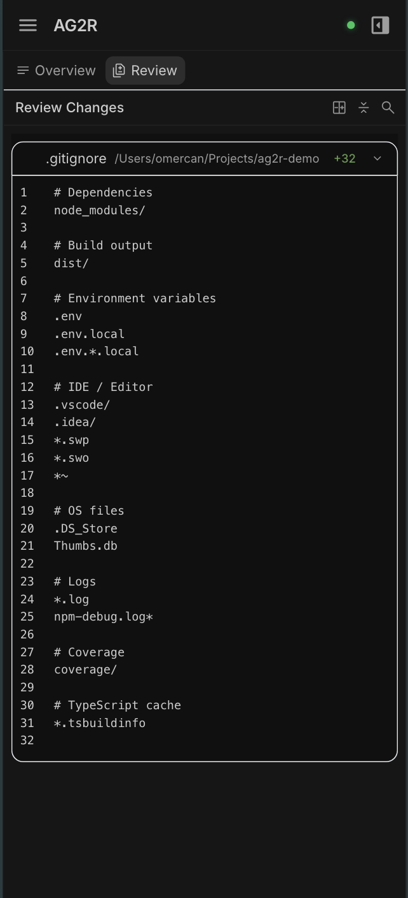<br><sub>Code Diff</sub></td>
    <td align="center"><br><sub>Queued Comments</sub></td>
  </tr>
  <tr>
    <td align="center"><br><sub>Overview Panel</sub></td>
    <td align="center"><br><sub>Push Notifications</sub></td>
    <td align="center"><br><sub>Subagent View</sub></td>
  </tr>
  <tr>
    <td align="center"><br><sub>Actions Pill</sub></td>
    <td align="center"><br><sub>Side Question</sub></td>
    <td align="center"><br><sub>BTW Panel</sub></td>
  </tr>
  <tr>
    <td align="center"><br><sub>Permission Banner</sub></td>
    <td align="center"><br><sub>Sidebar</sub></td>
    <td align="center"><br><sub>Review Files</sub></td>
  </tr>
</table>

---

## 🔄 Keep It Running (Optional)

A watchdog script can keep AG2R running and auto-update from the branch you're on. It detects the current branch, pulls new commits, and restarts the server when code changes.

```bash
# Run once to start (or add to cron for auto-recovery)
./scripts/watchdog.sh
```

**Cron setup** (checks every 5 minutes):

```bash
crontab -e
# Add this line:
*/5 * * * * cd ~/ag2r && ./scripts/watchdog.sh >> /tmp/ag2r-watchdog.log 2>&1
```

The watchdog reads configuration from `.env` — no need to pass env vars in the crontab. It auto-detects branch changes: if you switch branches (`git checkout next`), the next watchdog cycle restarts the server with the correct code. Your `.env` is gitignored and persists across branch switches.

The `tunnel-watchdog.sh` script can similarly keep a Cloudflare tunnel alive, and `ag-watchdog.sh` keeps Antigravity itself running with Chrome DevTools Protocol enabled.

---

## 🌿 Branching Strategy

| Branch | Purpose | Stability |
|--------|---------|----------|
| `main` | Current stable version — works with the AG version shown in the badge above | ✅ Stable |
| `prev-stable` | Previous stable version — frozen snapshot of `main` before the latest merge | ✅ Stable |
| `next` | Bleeding edge — being tested against an upcoming AG version | ⚠️ May break |

### How it works

When a new Antigravity version ships, the developer's workflow is:

1. Work on `next` to adapt AG2R to the new AG version
2. Once `next` is working, snapshot `main` → `prev-stable` and merge `next` → `main`
3. Continue fixing bugs on `next` and merging to `main` until stable
4. When things settle, `main` and `next` converge to the same state

### Which branch should I use?

**Start with `main`.** It works with the AG version shown in the badge at the top.

If `main` is broken (typically right after a new AG release), use `prev-stable` — it's a frozen snapshot that works with the previous AG version. Install that AG version and use `prev-stable` until `main` is updated.

```bash
# Fall back to the previous stable version
git checkout prev-stable
git pull origin prev-stable
```

If you want the absolute latest (and don't mind occasional breakage):

```bash
git checkout next
git pull origin next
```

> [!WARNING]
> The `next` branch may be unstable. Use `main` for a reliable experience, or `prev-stable` as a fallback.

---

## 🖼️ Gallery of Additional Views

Here is a collection of additional screenshots showcasing more subtle UI states, interactive dialogs, and legacy screen references.

### 💬 Commenting Flow Details
<table align="center">
  <tr>
    <td align="center">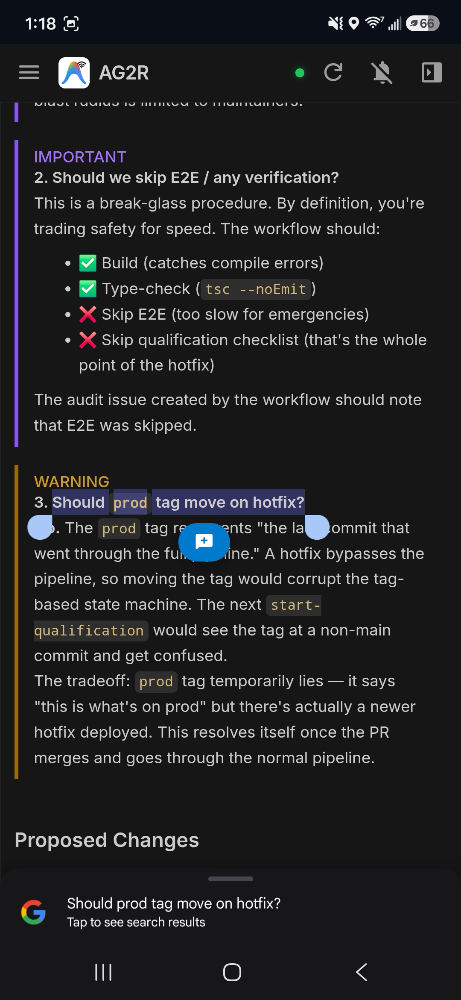<br><sub>Text Selection Trigger</sub></td>
    <td align="center">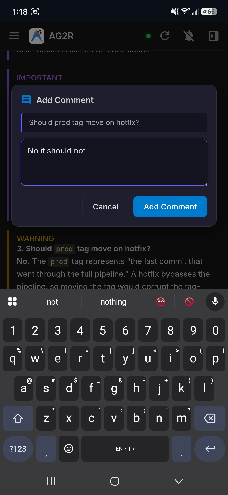<br><sub>Add Comment Dialog (Keyboard Open)</sub></td>
  </tr>
  <tr>
    <td align="center">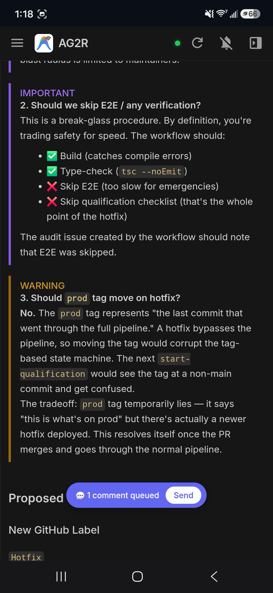<br><sub>Comment Queued Pill Indicator</sub></td>
    <td align="center">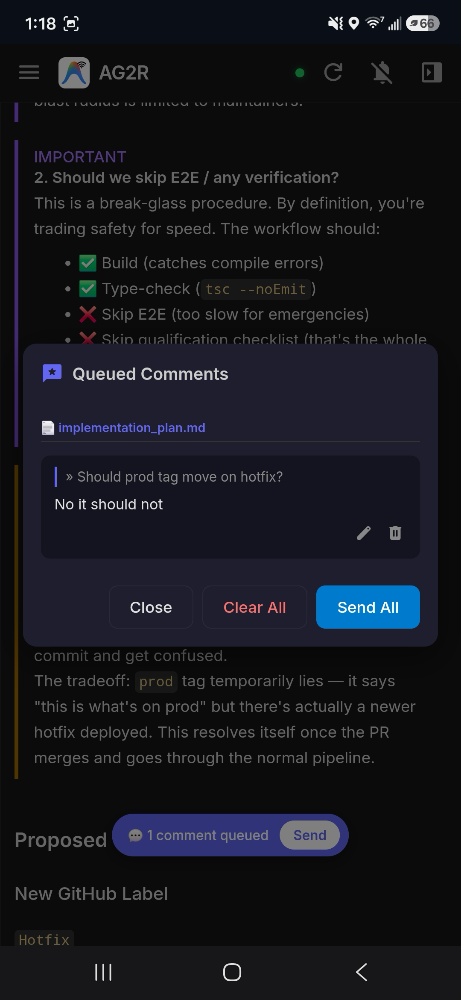<br><sub>Queued Comments List Dialog</sub></td>
  </tr>
</table>

### 🤖 Chat & Step Explorer States
<table align="center">
  <tr>
    <td align="center">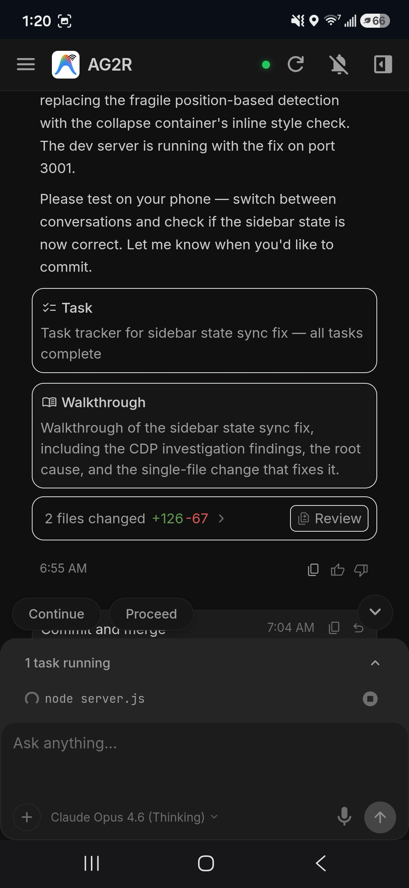<br><sub>Task & Walkthrough Cards</sub></td>
    <td align="center">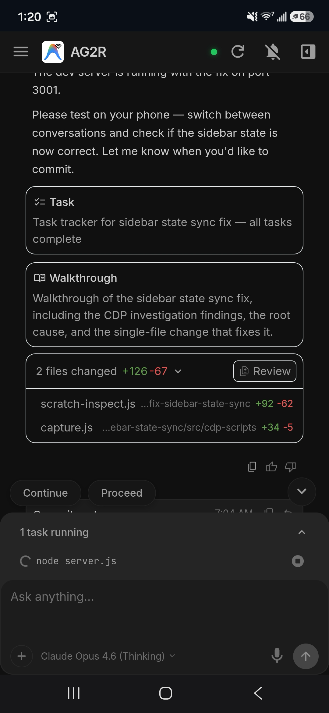<br><sub>Expanded Files Changed Dropdown</sub></td>
  </tr>
  <tr>
    <td align="center">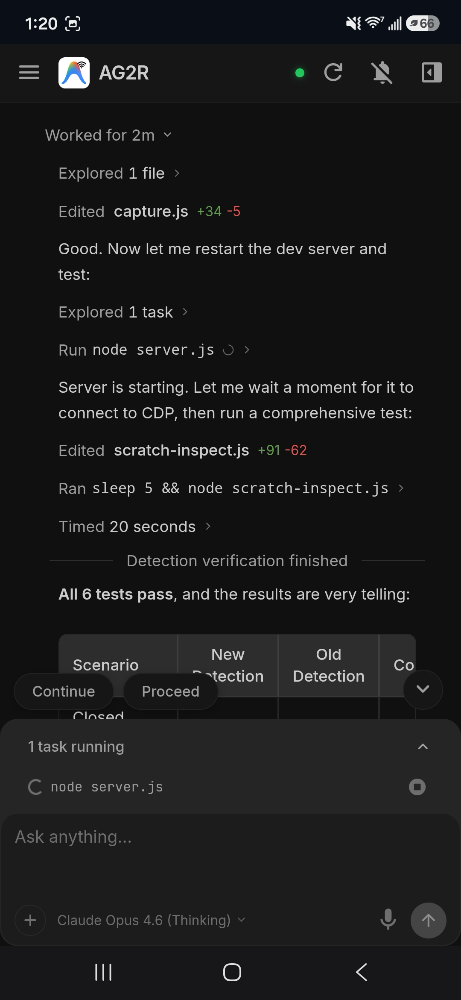<br><sub>Detailed Step Logs & Scenario Tables</sub></td>
    <td align="center">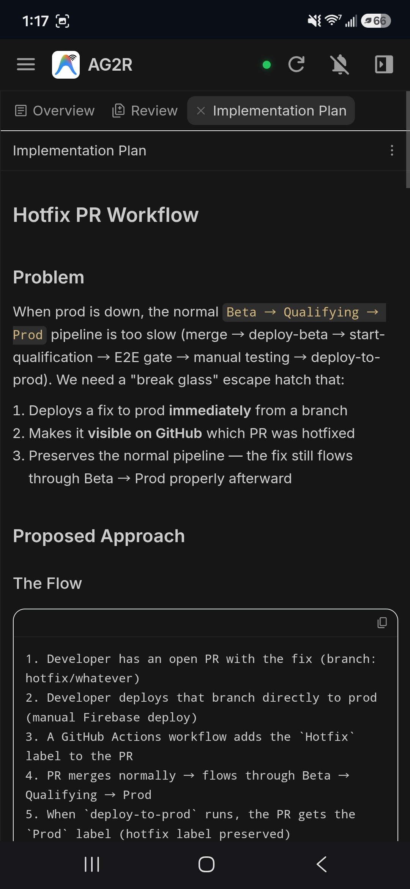<br><sub>Full-Screen Plan View</sub></td>
  </tr>
</table>

### 🔍 Review, Diff & Model Selectors
<table align="center">
  <tr>
    <td align="center">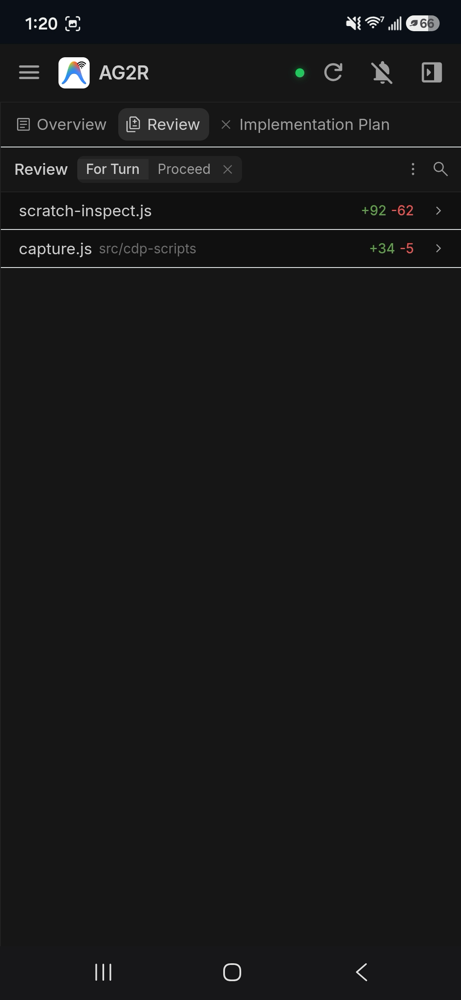<br><sub>Review Files Explorer</sub></td>
    <td align="center">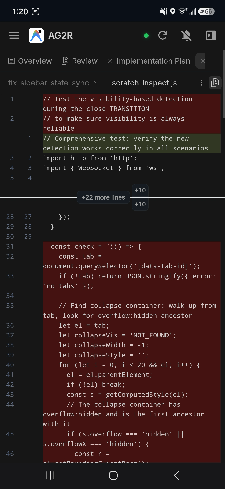<br><sub>Collapsed Code Diff Sections</sub></td>
  </tr>
  <tr>
    <td align="center">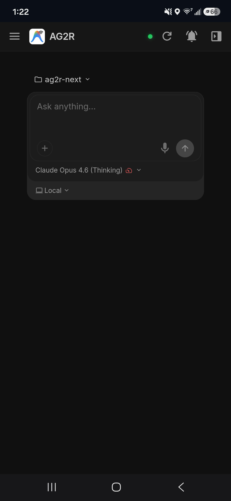<br><sub>New Conversation State</sub></td>
    <td align="center">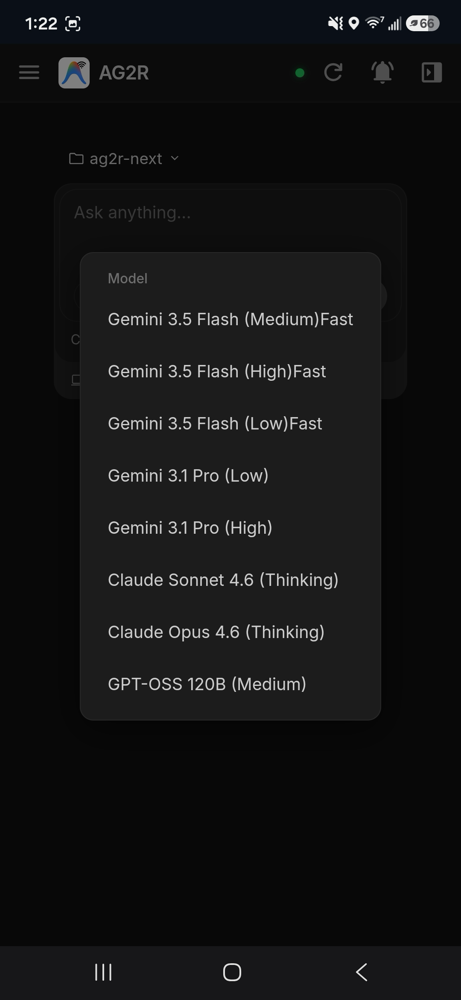<br><sub>Model Selector Dropdown</sub></td>
  </tr>
  <tr>
    <td align="center">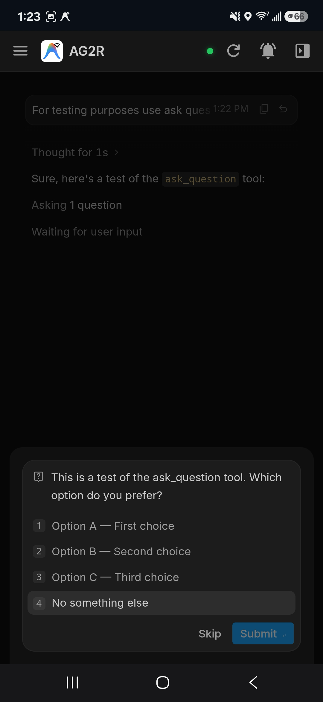<br><sub>Interactive choice with custom answer</sub></td>
    <td align="center"></td>
  </tr>
</table>

### 🏛️ Legacy Screen References
<table align="center">
  <tr>
    <td align="center"><br><sub>Legacy Live Chat</sub></td>
    <td align="center"><br><sub>Legacy Code Review</sub></td>
    <td align="center"><br><sub>Legacy Queued Comments</sub></td>
  </tr>
  <tr>
    <td align="center"><br><sub>Legacy Comment Dialog</sub></td>
    <td align="center"><br><sub>Legacy Review File List</sub></td>
    <td align="center"><br><sub>Legacy Conversation Sidebar</sub></td>
  </tr>
  <tr>
    <td align="center"><br><sub>Legacy Overview Panel</sub></td>
    <td align="center"><br><sub>Legacy Overview with Permission</sub></td>
    <td align="center"><br><sub>Legacy Permission Banner</sub></td>
  </tr>
  <tr>
    <td align="center"><br><sub>Legacy Push Notification</sub></td>
    <td align="center"><br><sub>Legacy Subagents</sub></td>
    <td align="center"></td>
  </tr>
</table>

---

## 📊 Telemetry

AG2R collects anonymous usage metrics (feature counts, crash reports — no personal data) to help improve the project. Set `AG2R_TELEMETRY=false` in your `.env` to disable.

## License

MIT — see [LICENSE](./LICENSE) for details.
